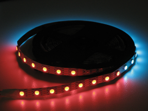
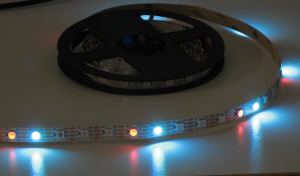

# RGB patterns for RGB led lines

## Introduction

This repository contains pattern functions for setting colors on a line of RGB leds (e.g. WS2812, WS2813). These patterns are used by [iot_rgb_controller](https://github.com/KrzysztofZurek1973/iot_rgb_controller).

## Dependencies

No requirements.

## Example

See [iot_rgb_controller](https://github.com/KrzysztofZurek1973/iot_rgb_controller).

In esp-idf environment `rgb_led_line_patterns` should be placed in _components_ directory.

The following pictures show patterns examples on led line.

 


## Features

The repository contains the following patterns:

1. **_Standby_** - pattern is active when controller is in state _OFF_, 2 diodes move from ends to the center, brightness = 1, refresh period 1 s
2. **_running_point_** - one point moves from the beginning to the end
3. **_rgb_palette_** - all diodes have the same color that changes smoothly in order: red -> green -> blue -> red and so on
4. **_tetris_** - the line is filled with points running from one end to the other, after filling, the removal of points begins, after such a cycle the color changes
5. **_static_** - static color, no changes
6. **_floating_ends_** - colors smoothly change from one end to the other
7. **_new_year_** - something like fireworks
8. **_christmas_** - something for christmas time

## Documentation

### Pattern parameters

Each pattern is described by parameters contained in the structure `pattParam_t`, these are:

- `dt` - refresh period in miliseconds
- `freq_max` and `freq_min` - maximum and minimum refresh frequency in Hz
- `speed` - percentage of maximum refresh speed, 0 .. 100
- `color_1` - RGB color used by some patterns
- `param_1`, `param_2`, `param_3` - pattern parameters, used differently in different patterns
- `brightness` - percentage of full brightness, 0 .. 100
- `on_diodes` - number of controlled diodes
- `old_diodes` - used when checking if the number of diodes has changed 
- `rgb_color_buff` - buffer for RGB values for each diode in the line

### Initialization

Initialization is done in

```
void initRgbPatterns(int32_t *diodes,
			uint8_t *rgb_buff,
			pattParam_t **paramTab,
			pRefreshFun *funTab){ 
```

**Parameters**

- `diodes`: pointer to variable with diodes number
- `rgb_buff`: buffer for RGB values, must have `diodes` * 3 bytes
- `paramTab`: table for pattern parameters
- `funTab`: from this table pattern functions are called by the controller thread

### How it runs

Pattern function is called every specified period of time (set in `pattParam_t param.dt`) by the controller thread. The function calculates new RGB values for each diode based on the parameters defined for the given pattern and saves them in the `rgb_color_buff` buffer.

Changing the RGB values to values that the diode understands and sending these values to the diodes takes place in the controller thread (see function `refreshRgb` in [thing_ws2812_controller](https://github.com/KrzysztofZurek1973/iot_components/tree/master/thing_ws2812_controller)).

**For sending data to led line SPI interface is used.**

## Source Code

The source is available from [GitHub](https://github.com/KrzysztofZurek1973/RGB_led_line_patterns).

## License

The code in this project is licensed under the MIT license - [LICENSE](https://github.com/KrzysztofZurek1973/RGB_led_line_patterns/blob/master/LICENSE) for details.

## Authors

* **Krzysztof Zurek** - [kz](https://github.com/KrzysztofZurek1973)

